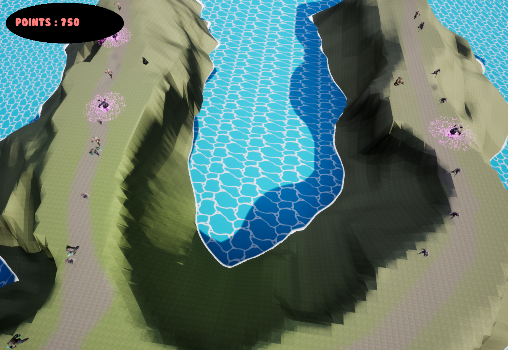
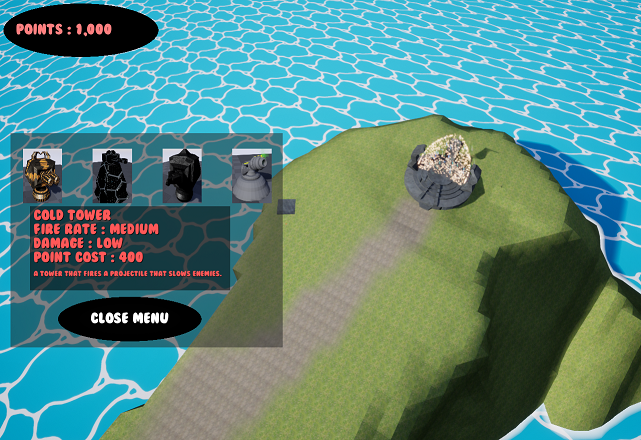

# Tower Defence Project by Gerard Connor

## Introduction

Hi my name is Gerard Connor and I created this project in order to learn and develop my skills within Unreal Engine whilst also expanding further in certain areas such as Level Design and 3d Modelling. My aim with this project was to create a somewhat enjoyable game in the Tower Defence genre using what skills I currently possessed at the time aswell as demonstrating what I could achieve with said skills.

## Gameplay

The game features design where the player must build defences to destroy incoming waves of enemies who are inexorably advancing towards the Tele-core. If the player fails to protect the core then they will fail the level. To avoid this they must build from a selection of towers that have their own strengths and weaknesses such as fire rate, damage and special effects. The game employs a point based system to build these towers wherein the player gains points by defeating enemies and spend points to build the towers themselves. The game has three levels with each increasing in difficulty as the player progresses from level to level. As with towers, the game features multiple types of enemy where they each are inherently different from one another, such as movement speed, health and special abilities.

#### Features

##### Tower Behaviour 
In the project, the towers use a collision based system wherein if the enemy walks into the box collision volume it would be immediatly targeted by the tower and fired upon. To make sure the tower waited to fire on the first enemy that entered the collision volume I created an array of actors which added each enemy to it as they entered the collision volume and only removed them when either the enemy had left the towers collision volume or the enemy had been destroyed. To make it so that the tower fires in order I set the target to the first element of the array at all times. The towers themselves can be upgraded to a superior version provided that the player has enough points to buy the upgrade. 

##### Point System

The utilises a point based economy where the player starts with a pool of points at the beginning of each level and acquires further points upon each destroyed enemy. The player then uses said points to buy and upgrade towers. To achieve this each tower was given a point cost value where if the player attempted to buy a tower, the point cost of the selected tower would be compared against the current point total that the player has. If the player has sufficient points then the tower will be placed however if the player has insuffcient points then they will be denied and the tower will not be placed.

